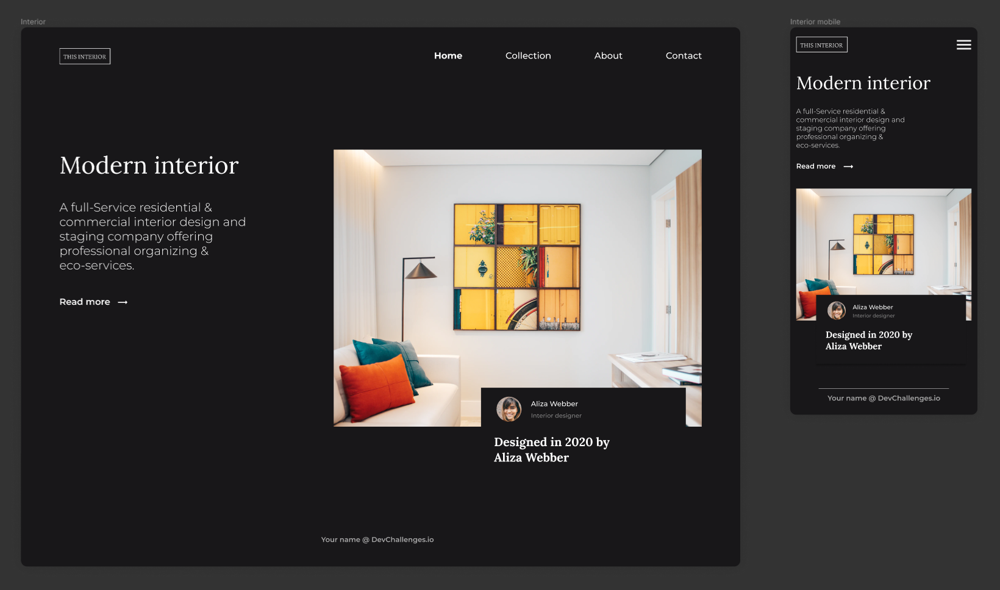

<h1 align="center">Interior Consultant</h1>

   Solution for a challenge from  <a href="http://devchallenges.io" target="_blank">Devchallenges.io</a>.

  <h3>
    <a href="https://interior-design-project-2022.netlify.app/">
      Demo
    </a>
     | 
    <a href="https://{your-url-to-the-solution}">
      Solution
    </a>
     | 
    <a href="https://devchallenges.io/challenges/Jymh2b2FyebRTUljkNcb">
      Challenge
    </a>
  </h3>

<!-- TABLE OF CONTENTS -->

## Table of Contents

- [Overview](#overview)
  - [Built With](#built-with)
- [Features](#features)
- [Contact](#contact)
- [Acknowledgements](#acknowledgements)

<!-- OVERVIEW -->

## Overview

- View the [live demo](https://interior-design-project-2022.netlify.app/)
- 3rd Dev Challenges project
- Mobile first

### Built With

- [HTML](https://www.w3schools.com/html/)
- [CSS](https://www.w3schools.com/css/)
- [Tailwind](https://tailwindcss.com/)
- [Javascript](https://www.w3schools.com/js/)

## Features

This application/site was created as a submission to a [DevChallenges](https://devchallenges.io/challenges) challenge. The [challenge](https://devchallenges.io/challenges/Jymh2b2FyebRTUljkNcb) was to build an application to complete the given user stories.

## Contact

- GitHub [DevNitro5](https://github.com/DevNitro5)
